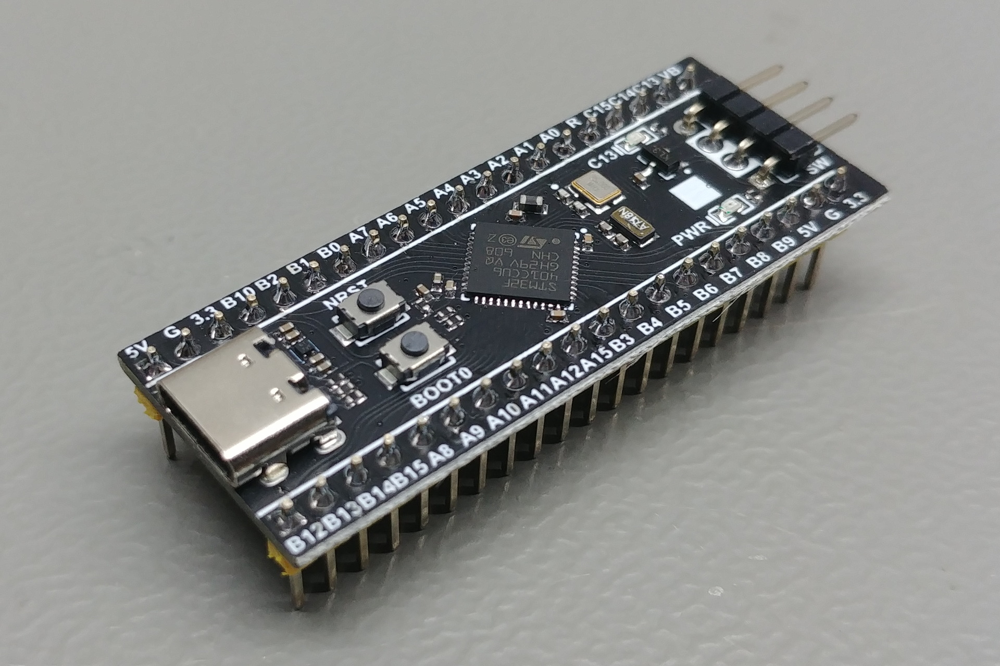
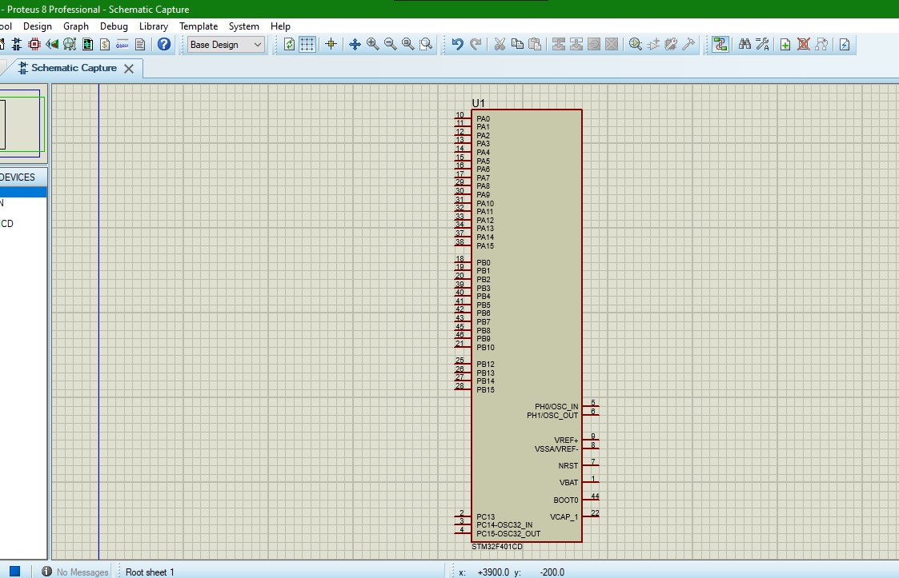
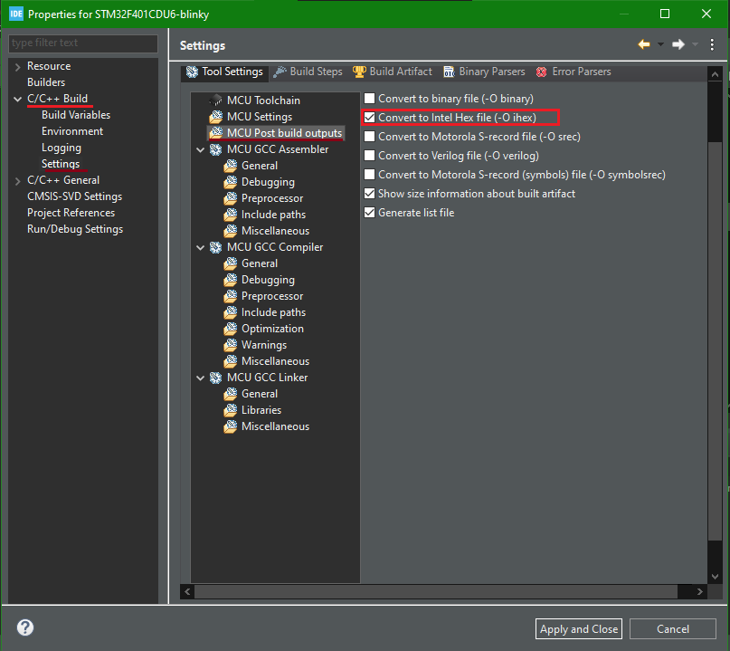

# LED blinking
## Prerequisites
 - STM32 board or emulation software  
    In this case, It's going to be used the STM32F401CDU6:
    
    Or the simulated version in *Proteus*:
    
 - STM32CUBE IDE installed
## Coding
1. Create a new STM32 project.
2. Search the microcontroller *STM32F401CDU6*.
3. Configure the peripherals in IOC user interface. Set the pin C13 as output and pull-up for the LED.
4. Save the configuration and generate the *C* code.
5. Verify the generated code in `main.c` file.  
6. Edit the `main.c` file and use a function to toggle the pin C13.
  ```C
  while (1)
  {
	  HAL_GPIO_TogglePin(GPIOC, GPIO_PIN_13);
	  HAL_Delay(500);
  } 
  ```
7. Compile the code and detect any failure.  
  **For the physical board:**  
8. Connect the STLink on the SWDIO port in STM32F4 board and Run the code.  
  **For the simulated board:**
9. generate the `.hex` file. Go to `Project > Properties` and on the following screen select the red box as in the  next picture.  
  
10. Compile the code again and a `.hex` file will be generated in `Debug/`
11. Upload the `.hex` file in the STM32F4 simulated board on *Proteus*.